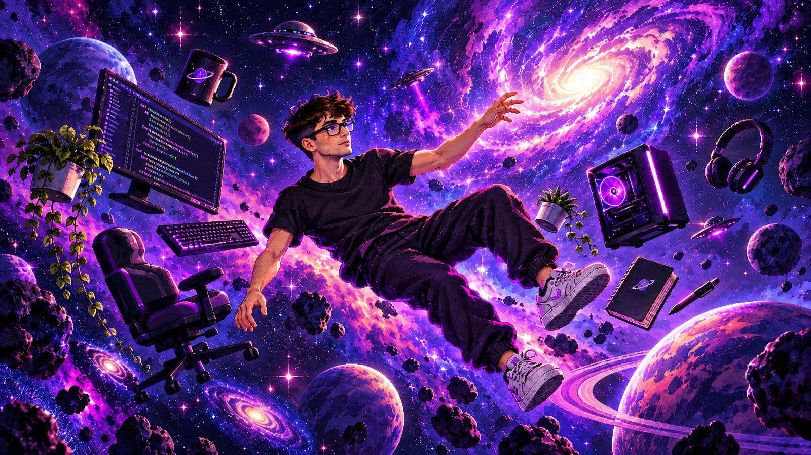

  

<h1 align="center">Hi, I'm Stefano 👋</h1>

  

  UX/UI designer & builder from Milan, Italy. Founder of <a href="https://www.stopidesign.com"><b>Stopi Design</b></a>.

---

<h2 align="center">🪐 About me</h2>

I've been designing and building digital products for 5+ years: premium websites, custom software, mobile apps and, lately, a lot of AI automation.

I work with Italian businesses and professionals who want one partner from the first sketch to the deploy, without layers of account managers in between. You talk to the person who designs it and builds it.

I'm a builder, not an influencer. I measure the work by what it does for the business: more leads, fewer manual hours, a product people actually use.

**Right now I'm**
- shipping Next.js sites on Cloudflare with motion that doesn't kill performance
- building AI agents that take over email, documents and admin work for SMBs
- tinkering with a custom Dynamic Island for Windows, just for fun

 

---

<h2 align="center">🛠️ Stack</h2>

  
   
  

---

<h2 align="center">🚀 Connect</h2>

  
  
  
  

  <a href="https://calendly.com/stopidesigner/30min"><b>Got a project in mind? Book a 30-min call →</b></a>

